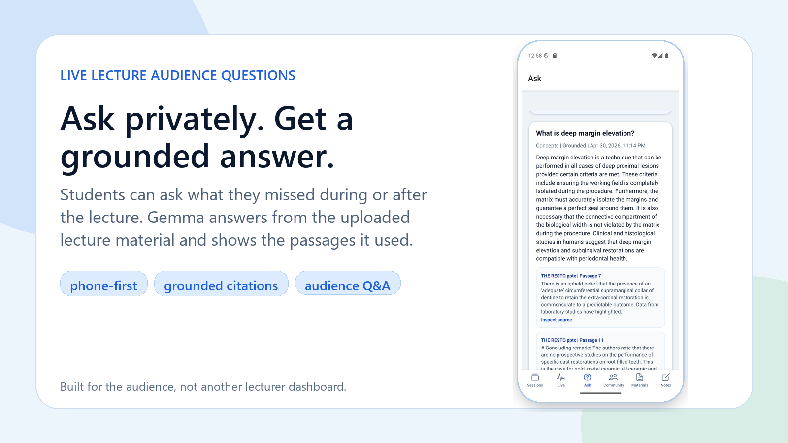
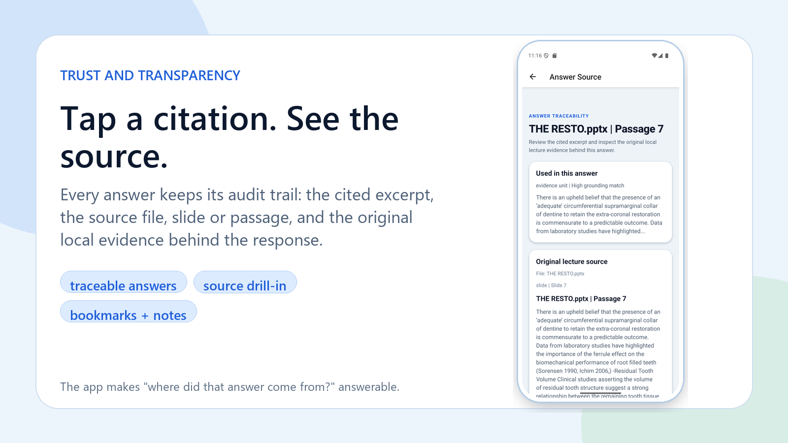
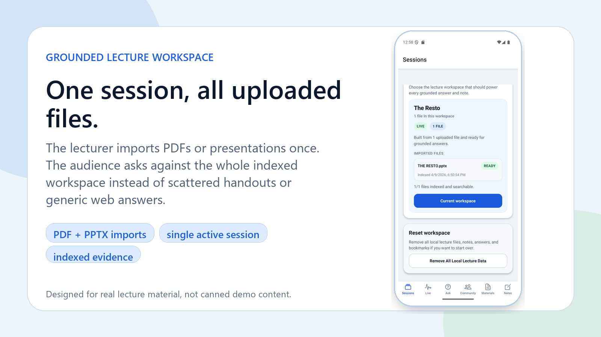
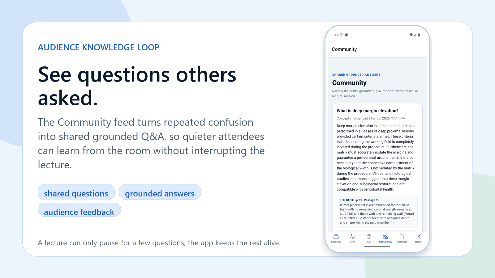

# Lecture Companion

Lecture Companion is a professional local-hardware audience companion for live lectures. A lecturer can provide the lecture files once, and audience members use their phones during or after the session to ask clarifying questions, optionally stay anonymous, see shared community questions, and receive Gemma-grounded answers tied to the actual lecture material.

For the Kaggle Gemma 4 Good Hackathon demo, the Android app/emulator is the audience-facing interface and Gemma 4 E4B runs locally on the evaluator's PC through the desktop bridge. E4B is not phone-resident in this demo. The project avoids hosted cloud inference and does not redistribute model weights.

## Demo Gallery

These screens come from the real Android emulator demo flow. Full-size media and captions are available in [submission-media/MEDIA_GALLERY.md](./submission-media/MEDIA_GALLERY.md).

<table>
  <tr>
    <td width="50%">
      
    </td>
    <td width="50%">
      
    </td>
  </tr>
  <tr>
    <td width="50%">
      
    </td>
    <td width="50%">
      
    </td>
  </tr>
</table>

## Judge Quickstart

This repository is prepared for the Kaggle Gemma 4 Good Hackathon. The code is public and reproducible, but Gemma model weights are intentionally excluded from git because of size and upstream licensing terms.

1. Clone the repository from `https://github.com/Endodontist27/gemma`.
2. Run `npm install`.
3. Run `npm run db:generate`.
4. Download the official `google/gemma-4-E4B-it` model into `models/google/gemma-4-E4B-it/source/`.
5. Run `npm run check`.
6. Start the desktop demo bridge with `npm run model:desktop:bridge`.
7. Run the Android emulator UI with `npm run android:dev`.
8. Upload lecture files locally, ask audience-style clarification questions in the Ask tab, and inspect cited sources.

Submission materials are summarized in [COMPETITION_WRITEUP.md](./COMPETITION_WRITEUP.md) and [KAGGLE_SUBMISSION_CHECKLIST.md](./KAGGLE_SUBMISSION_CHECKLIST.md).

## Purpose

- import a lecture pack into the local app workspace
- persist the lecture session graph locally in SQLite
- answer only from grounded lecture materials, glossary entries, and transcript content
- support audience questions that can be private, anonymous, or shared to the local community
- keep notes, bookmarks, summaries, community Q&A, and lecturer insight signals in local app storage

## Problem

Lecture Q&A does not scale well in real rooms.

- Lecturers can only answer a few questions live, so many audience questions are never addressed.
- Audience members may feel embarrassed to ask questions publicly.
- People often forget their questions before Q&A time.
- Students leave lectures with unclear concepts but no grounded way to clarify them later.
- Generic AI answers may hallucinate or ignore the actual lecture material.
- Lecture materials are scattered across slides, PDFs, notes, glossaries, and transcripts.
- Other audience members may have the same confusion, but there is no shared question space.
- Lecturers lack visibility into what the audience did not understand.
- Post-lecture feedback is usually too vague to improve teaching in real time.
- Students need answers that are traceable back to the exact lecture source.

## Solution

Lecture Companion creates a local audience layer around a lecture. The lecturer-provided files become the source of truth, Gemma 4 answers questions from those files, and the audience can ask without interrupting the room. Shared questions and aggregated confusion signals help the lecturer understand what needs clarification during or after the session.

## Local-Hardware Design

- SQLite is the only persistence layer.
- The app starts clean with no bundled lecture session imported by default.
- No hosted cloud service is required for the competition demo flow.
- The Android emulator talks to the desktop-local Gemma bridge over localhost during the E4B demo.
- `google/gemma-4-E4B-it` is the documented competition demo model and lives under `models/google/gemma-4-E4B-it/source/`.
- `google/gemma-4-E2B-it` remains an optional Android GGUF experiment under `models/google/gemma-4-E2B-it/`.
- Unsupported questions return an explicit unsupported state instead of speculative chat behavior.
- Web renders an unsupported shell because the real product workflow is Android audience UI plus local Gemma runtime integration.

## Architecture Layers

- `src/app`
  Expo Router route files only.
- `src/app-shell`
  Bootstrap, dependency container types, and runtime composition kept outside the Expo Router scan tree.
- `src/presentation`
  Minimal screens, view-model hooks, and reusable components.
- `src/application`
  Use-cases, orchestrators, DTOs, and application ports.
- `src/domain`
  Entities, value objects, repository contracts, service contracts, and business rules.
- `src/infrastructure`
  Drizzle/SQLite implementation, repositories, lecture-pack import, grounded source import, retrieval engine, Gemma runtime integration, and local storage.
- `src/shared`
  Config, constants, utilities, and the concrete container assembly outside the route tree.

More detail is in [ARCHITECTURE.md](./ARCHITECTURE.md).

## Local Database

The app uses `expo-sqlite` with Drizzle ORM. The schema is split by bounded context under `src/infrastructure/database/schema/`, and runtime migrations are generated into `src/infrastructure/database/migrations/appMigrations.ts`.

Core tables:

- `lecture_sessions`
- `lecture_materials`
- `material_chunks`
- `glossary_terms`
- `transcript_entries`
- `summaries`
- `qa_categories`
- `questions`
- `answers`
- `answer_sources`
- `notes`
- `bookmarks`

More detail is in [DATABASE.md](./DATABASE.md).

## Lecture Data Import

Lecture Companion supports two local import paths:

- a complete lecture-pack JSON validated with Zod and imported through `LecturePackImporter`
- grounded source uploads that assemble a lecture pack locally from real lecture files before import

Supported grounded source uploads:

- session metadata: `session.json`, `session.txt`
- materials: `.txt`, `.md`, `.markdown`, `.csv`, `.json`, `.pptx`, `.pdf`
- glossary: `.csv`, `.json`, `.txt`, `.md`, `.pdf`
- transcript: `.txt`, `.json`, `.pdf`
- optional summaries, categories, and public Q&A through `.json`

Current limitation:

- searchable PDFs are supported through local Android text extraction in the development build
- `.pptx` PowerPoint files are supported through local slide-text extraction before import
- scanned PDFs without embedded text still need OCR before import
- Word and spreadsheet files should still be exported to text-based formats before upload

Import flow:

1. parse and validate the JSON pack
2. build an in-memory session graph
3. resolve public Q&A source references against local lecture entities
4. persist the full graph transactionally

Invalid source references fail before any database transaction begins.

For grounded source uploads, the app first builds a lecture-pack JSON locally from the uploaded files, validates the assembled pack, and then runs the same transactional import path.

On Android, searchable PDF uploads are parsed locally through a native PDF text-extraction module before the lecture-pack builder runs.

## Grounded RAG Boundaries

This app is intentionally not a free-form chatbot.

- answers must be grounded only in local lecture content
- source priority is fixed: glossary, then lecture materials, then transcript
- unsupported questions return a clear unsupported answer state
- no outside knowledge, no cloud retrieval, and no speculative assistant behavior is allowed

## Gemma 4 Targets

The repository has two clearly separated Gemma lanes:

- Competition demo lane: `google/gemma-4-E4B-it` on a desktop-local RTX 3060 12 GB class GPU using CUDA + bitsandbytes 4-bit NF4. This is the recommended judge path because it gives the best grounded answer quality.
- Optional Android GGUF lane: `google/gemma-4-E2B-it` as a GGUF Android artifact through a `llama.rn` / `llama.cpp` style backend. This path is kept as a deployment experiment and is not the primary competition demo claim.

- `src/shared/config/modelConfig.ts` is the single place that selects the target model.
- `LLMService` remains the app-facing text generation contract.
- `GemmaAdapter` is the infrastructure seam for local Gemma execution.
- Android uses a strict local-runtime path: if Gemma is unavailable, the app surfaces a runtime error instead of silently falling back to mock generation.
- Web and iOS remain unsupported for true Gemma runtime in this pass.
- If mobile packaging later needs a different Android runtime or model format, the adapter backend can change without rewriting app logic.
- Future fully phone-resident deployment feasibility still depends on runtime overhead, usable context size, memory pressure, battery impact, and platform tooling maturity.
- TurboQuant is not the app-bundle workaround here because it compresses KV cache at runtime instead of materially shrinking the model file users must store.
- The current Android status/native bridge still sits behind the adapter seam, so the app logic can survive a future move to a different GGUF-capable backend without rewriting application logic.
- The desktop demo bridge uses `google/gemma-4-E4B-it` with bitsandbytes 4-bit NF4 by default on the RTX 3060 12 GB target, with `--quantization bnb-8bit` reserved for GPUs with more headroom.

## Repo-Local Model Workflow

Model binaries stay inside the repo tree during local development but are gitignored by default.

Competition demo model path:

- `models/google/gemma-4-E4B-it/source/`
- `models/google/gemma-4-E4B-it/manifest.json`

Optional Android GGUF model path:

- `models/google/gemma-4-E2B-it/source/`
- `models/google/gemma-4-E2B-it/android/`
- `models/google/gemma-4-E2B-it/manifest.json`

Competition demo flow:

1. `npm run model:download:desktop`
2. `npm run check`
3. `npm run model:desktop:bridge`
4. `npm run android:dev`

Optional Android GGUF flow:

1. `npm run model:download`
2. `npm run model:download:android`
3. `npm run model:verify`
4. `npm run model:stage:android`
5. `npm run android:dev`

Optional production Android GGUF flow:

1. `npm run model:download`
2. `npm run model:download:android`
3. `npm run model:verify`
4. build a production Android release
5. the packaged GGUF is copied into app-private storage on first launch, with no PC staging step

Notes:

- The competition submission does not redistribute Gemma weights; judges download the official model into the documented local path.
- Development builds can still stage the Android GGUF artifact into the installed app's private files directory at `files/lecture-companion/gemma-4-E2B-it-Q3_K_S.gguf`.
- Production builds now package the selected GGUF as an Android asset and install it into the same private path on first launch, so the shipped app no longer depends on a PC-side staging step.
- `npm run model:download:android` downloads the repo-local GGUF artifact for the same `google/gemma-4-E2B-it` target lineage into `models/google/gemma-4-E2B-it/android/`.
- `npm run model:prepare:android` is now intentionally informational because this repo does not yet script a local GGUF quantization pipeline from the raw Hugging Face weights.
- `npm run model:stage:android` expects the Android dev build to already be installed, then streams the model directly into the app sandbox over `adb`.
- Expo Go is not the real runtime path for local Gemma execution. Use an Expo development build.
- Even with the aggressive GGUF quant, this exact model is still measured in gigabytes. It cannot honestly be reduced to a typical lecture-app-sized MB bundle today.

## Desktop Local Gemma Harness

The repo also includes a desktop-local harness for testing the higher-quality E4B demo model on your PC without the Android runtime:

- script entrypoint: `scripts/gemma/desktop_harness.py`
- npm wrapper: `npm run model:desktop -- ...`
- exact local model path: `models/google/gemma-4-E4B-it/source/`
- default model: `google/gemma-4-E4B-it`
- default RTX 3060 profile: CUDA + bitsandbytes 4-bit NF4

Useful commands:

```bash
npm run model:download:desktop
npm run model:desktop -- doctor
npm run model:desktop -- answer -- --question "What is grounding?"
npm run model:desktop -- answer -- --pack path/to/lecture.pack.json --question "What is RAG?" --dry-run --json
npm run model:desktop -- summary -- --pack path/to/lecture.pack.json
npm run model:desktop -- answer -- --question "What is working length?" --quantization bnb-8bit
```

Notes:

- This harness uses the same grounded prompt shape as the app and only reads from local lecture-pack JSON evidence.
- The desktop harness defaults to `--device cuda --quantization bnb-4bit-nf4` for the RTX 3060 12 GB demo target.
- Try `--quantization bnb-8bit` only if the GPU has enough free VRAM; on the local RTX 3060 test, 8-bit requested CPU/disk offload and was not the stable default.
- `--dry-run` is the safest first step because it prints the selected evidence and final prompt without loading the model.
- Real desktop generation requires local Python dependencies such as `transformers`, `torch`, `accelerate`, and `bitsandbytes`.
- The PC harness is the recommended way to validate prompt quality and grounded outputs locally when Android emulators cannot run the native Gemma runtime.

## Competition Reproduction

This repository is prepared for the Kaggle `Gemma 4 Good Hackathon` as a local-hardware app submission.

For the full submission narrative, architecture framing, judging flow, and suggested track fit, see [COMPETITION_WRITEUP.md](./COMPETITION_WRITEUP.md).

- The repo contains the full application code, local indexing pipeline, Android/emulator UI shell, and desktop Gemma bridge.
- The repo does **not** redistribute Gemma weights.
- Judges should download the official Gemma model from the public source and place it in the documented repo-local `models/` path.
- Once the official model is installed on the local desktop runtime, the demo runs without any hosted cloud inference service.

Recommended judge flow:

1. Clone the repo.
2. Install Node and Python dependencies.
3. Download the official `google/gemma-4-E4B-it` model into `models/google/gemma-4-E4B-it/source/`.
4. Run `npm run check`.
5. Run `npm run model:desktop:bridge`.
6. Run the Android emulator shell with `npm run android:dev` or launch the existing development build.
7. Upload lecture files locally in the app and ask audience-style clarification questions.

Important notes for reproduction:

- The desktop competition demo path is the recommended evaluation path because it uses the stronger local `google/gemma-4-E4B-it` model on an RTX 3060 12 GB class GPU.
- An experimental Android GGUF runtime remains available through the smaller E2B path, but the higher-quality competition demo is the desktop E4B bridge.
- User lecture files are imported locally and indexed into searchable grounded evidence units; no hosted cloud inference service or hosted backend is required.
- Pretrained model weights are intentionally excluded from git because of size and licensing practicality, which is permitted as long as reproduction instructions identify the official source and the local setup clearly.

## Quality Gates

- strict TypeScript
- ESLint + Prettier + EditorConfig
- Vitest unit coverage for importer validation, grounded QA atomicity, retrieval priority, repository ordering, strict Android Gemma fallback behavior, and script guards
- `npm run check` runs `typecheck`, `lint`, and `test`

## Android Release Readiness

The repo is configured for a clean Android release path, separate from the desktop-local E4B competition demo:

- production builds resolve through `app.config.js` with `APP_ENV=production`
- the production Android package id is `com.endodontist27.lecturecompanion`
- optional Android GGUF production builds package the selected GGUF from `models/google/gemma-4-E2B-it/android/` and install it into app-private storage on first launch
- production config blocks development-only permissions such as `SYSTEM_ALERT_WINDOW`
- release signing is no longer allowed to fall back to the debug keystore
- `android/keystore.properties.example` documents the upload-key shape expected by Gradle
- `eas.json` includes a production Android App Bundle profile for Play submission
- the Sessions screen includes a local-data reset action so test imports can be cleared before handoff

Manual Play Console work still required:

- create and protect the real upload keystore
- copy `android/keystore.properties.example` to `android/keystore.properties` or set the signing env vars
- upload an AAB, not a debug APK
- complete the Play listing, screenshots, content rating, and Data safety form
- provide a privacy policy URL if your Play category/policy answers require one

Current official Play baseline:

- new submissions must target Android 15 / API level 35 or higher
- new Play submissions use Android App Bundles

Sources:

- [Meet Google Play's target API level requirement](https://developer.android.com/google/play/requirements/target-sdk)
- [About Android App Bundles](https://developer.android.com/guide/app-bundle)

## Run Locally

Competition demo path:

```bash
npm install
npm run db:generate
npm run check
npm run model:download:desktop
npm run model:desktop:bridge
npm run android:dev
```

Optional Android GGUF path:

```bash
npm install
npm run db:generate
npm run check
npm run model:download
npm run model:download:desktop
npm run model:download:android
npm run model:verify
npm run model:stage:android
npm run android:dev
```

## Project Snapshot

```text
src/
  app/
    (tabs)/
  app-shell/
    bootstrap/
    navigation/
  presentation/
    components/
    hooks/
    screens/
    view-models/
  application/
    dto/
    orchestrators/
    ports/
    use-cases/
  domain/
    business-rules/
    entities/
    repository-contracts/
    service-contracts/
    value-objects/
  infrastructure/
    database/
      mappers/
      migrations/
      schema/
    gemma-runtime/
    ground-truth-import/
    lecture-pack/
      import/
      sample-data/
    local-storage/
    mock-llm-services/
    repositories/
    retrieval-engine/
  shared/
    config/
      bootstrap/
    constants/
    types/
    utils/
models/
  google/
    gemma-4-E2B-it/
      source/
      android/
    gemma-4-E4B-it/
      source/
modules/
  gemma-runtime/
  pdf-text-extractor/
scripts/
  gemma/
test/
  app-shell/
  application/
  fixtures/
  infrastructure/
  presentation/
```
